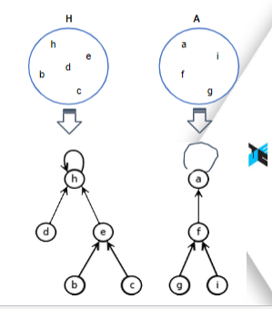

# Disjoint-Sets
Implementation of Disjoint Set data structure.
## Integrantes:
- Fabryzzio Jossue Meza Torres
- Fernando Alonso Usurin Arias
- Yoselyn Victoria Miranda Chirinos

## Referencias APA:
* Presentación 08(Disjoint Sets).(2024). Ojeda,B., *Algoritmo y estructura de datos: CS2023* (págs. 1-18).UTEC
